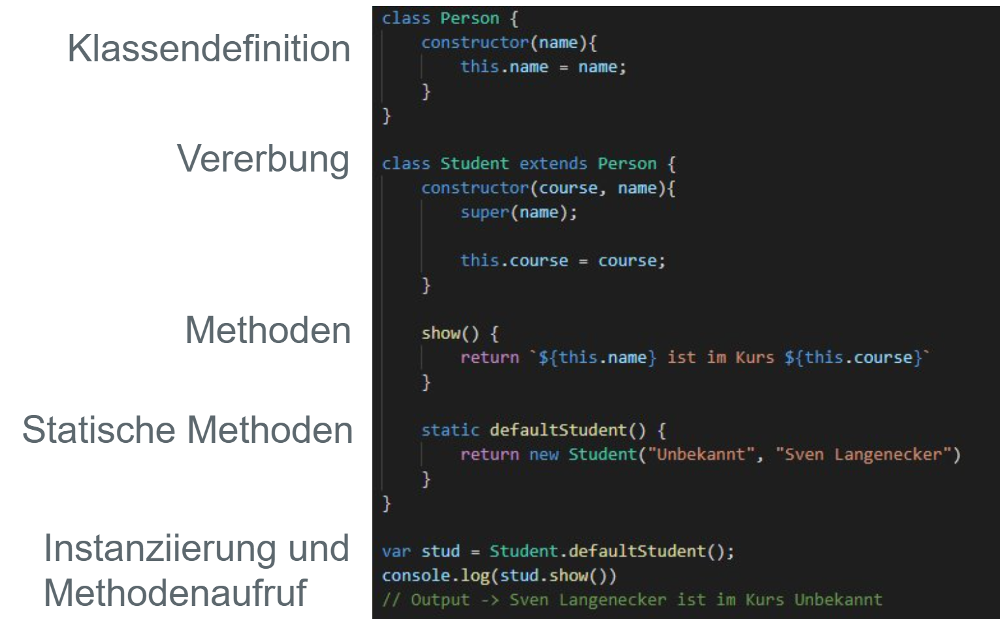

# Einleitung

## Allgemeines

- entwickelt 1995 von Brendan Eich um Webseiten mit Interaktion auszustatten
- Eine der beliebtesten Programmiersprachen
- Trotz Namensähnlichkeit nicht mit JAVA verwandt, aber beide orientieren sich von der Syntax an C
  {height=150%}

## Wer steht hinter JavaScript

ECMA International (früher: European Computer Manufacturers Association)


## Auf welchen Plattformen läuft JavaScript? {.allowframebreaks}


**Webbrowser:** JavaScript wird von allen modernen Browsern unterstützt — einschließlich Chrome, Firefox, Safari, Edge und Opera — und somit auf Betriebssystemen wie Windows, macOS, Linux, iOS und Android.

**Serverseitige Plattformen:** Mit Node.js kann JavaScript serverseitig ausgeführt werden. Node.js ist auf Windows, macOS, Linux und anderen Betriebssystemen verfügbar und ermöglicht die Entwicklung von skalierbaren Anwendungen.

**Desktop-Anwendungen:** Frameworks wie Electron erlauben es, plattformübergreifende Desktop-Anwendungen mit JavaScript, HTML und CSS zu erstellen. Diese Anwendungen laufen auf Windows, macOS und Linux.

**Mobile Anwendungen:** Mit React Native, Ionic oder NativeScript können Entwickler native mobile Anwendungen für iOS und Android mit JavaScript erstellen.

**Eingebettete Systeme und IoT-Geräte:** Plattformen wie Espruino und Johnny-Five und ermöglichen die Programmierung von Mikrocontrollern und eingebetteten Systemen mit JavaScript.

**Datenbanken:** Datenbanken wie MongoDB und CouchDB, erlauben die Verwendung von JavaScript für Abfragen und serverseitige Skripte -> native Integration von JavaScript. Durch ORMs (Object Relational Mappers) ist aber auch die Integration von anderen Datenbanken möglich (MySQL, PostgreSQL, MariaDB, SQLite, Microsoft SQL Server)

**Shell-Scripting und Automatisierung:** Tools wie Node.js können für Skripte und Automatisierungsaufgaben auf Betriebssystemebene verwendet werden.

## Ausführung JavaScript - Eingebettetet im HTML

```html
<!DOCTYPE html>
<html lang="de">
  <head>
    <meta charset="UTF-8" />
    <title>Meine Webseite</title>
  </head>
  <body>
    <h1>Willkommen auf meiner Webseite</h1>
    <script>
      console.log("Hallo Welt");
    </script>
  </body>
</html>
```

---

## Ausführung JavaScript - Extern referenziert im HTML {.allowframebreaks}

1. Erstelle eine Datei namens script.js mit folgendem Inhalt:

```javascript
alert("Hallo, Welt!");
```

2. Binde die externe Datei in dein HTML-Dokument ein

```html
<!DOCTYPE html>
<html lang="de">
  <body>
    <h1>Willkommen auf meiner Webseite</h1>
    <script src="script.js"></script>
  </body>
</html>
```

### Platzierung

**_Im `<head>`-Bereich_**

Du kannst das Script im `<head>`-Tag einbinden. Dies bedeutet, dass das Script ausgeführt wird, sobald der HTML-Header geladen ist, **bevor** der restliche Inhalt der Seite geladen wird.

```html
<head>
  <script src="script.js"></script>
</head>
```

Hinweis: Wenn das Script direkt im `<head>`-Tag geladen wird, kann es zu Problemen führen, da das DOM noch nicht vollständig geladen ist. Um dieses Problem zu vermeiden, kannst du das defer-Attribut verwenden:

```html
<script src="script.js" defer></script>
```

---

**_Am Ende des `<body>`-Tags_**

Eine gängige Praxis ist es, JavaScript kurz vor dem schließenden `</body>`-Tag einzubinden. Auf diese Weise wird sichergestellt, dass der gesamte HTML-Inhalt geladen ist, bevor das Script ausgeführt wird.

```html
<body>
  <!-- Inhalt der Seite -->
  <script src="script.js"></script>
</body>
```

**_Mit dem async-Attribut_**

Wenn du das async-Attribut verwendest, wird das Script parallel zum Laden der Seite geladen und sobald es verfügbar ist, ausgeführt. Dies kann für bestimmte Scripts sinnvoll sein, die keine Abhängigkeit von anderen DOM-Elementen haben.

```html
<script src="script.js" async></script>
```

## Ausführung JavaScript - Browser Konsole

1. Öffne die Entwicklertools in deinem Browser: In Chrome: Rechtsklick -> "Untersuchen" -> Tab "Konsole" oder <kbd>F12</kbd>

2. Führe JavaScript-Code direkt in der Konsole aus:

```javascript
console.log("Hallo, Welt!");
```

---

## Ausführung JavaScript - Serverseitiges JavaScript

1. Erstelle eine Datei mit folgendem Inhalt und speichere sie als Test.js ab

```javascript
console.log("Hallo, Welt!");
```

2. Führe die Datei in der Kommandozeile mit dem Befehl `node Test.js` aus

# Datentypen

## Variables

### Übersicht

- speichern Daten temporär
- Analogie: beschrifteter Karton mit Inhalt

---

| **Kom-ponente (DE)** | **Kom-ponente (EN)** | **Beschreibung**                                                            | **Beispiel**    |
| -------------------- | -------------------- | --------------------------------------------------------------------------- | --------------- |
| Bezeichner           | Identifier           | Name der Variable, die ihren Wert bezeichnet.                               | test            |
| Literal              | Literal              | Wert, der der Variable zugewiesen wird.                                     | 42, "Text"      |
| Schlüssel-wort       | Keyword              | Reserviertes Wort in der Programmiersprache für Deklaration oder Steuerung. | let, const, var |

---

### Variablen Keywords in JavaScript

- var (veraltet, weil globaler scope(Geltungsbereich))
- let (block-scoped -> Geltungsbereich ist eine näheste von geschweiften Klammern umschlossenen Syntaxen, z.B. if statement)
- const (block-scoped, kann nicht nochmals zugewiesen werden)

---

### Numerische und Boolsche Literals

| **Typ**                 | **Beispiel**          |
| ----------------------- | --------------------- |
| Hexadezimale Konstanten | `var test = 0x12f`    |
| Binäre Konstanten       | `var test = 0b011101` |
| Oktale Konstanten       | `var test = 0o767`    |
| Ganzzahlenkonstanten    | `var test = 123456`   |
| Gleitkommazahlen        | `var test = 12.34`    |
|                         | `var test = 12.34e2`  |
| Boolesche Konstanten    | `var test = true`     |
|                         | `var test = false`    |

---

### Zeichenketten/Strings Literals

```javascript
// Backticks
var jsString = `Das ist ein String`;
// einfache Anführungszeichen
var jsString = "Das ist ein String";
// doppelte Anführungs-zeichen
var jsString = "Das ist ein String";

// Vorteil von Backticks:
var jsString = `half of 100 is ${100 / 2}`;
console.log(jsString);
// -> half of 100 is 50
```

## Kommentare

### Einzeilige Kommentare

- Verwenden Sie `//` gefolgt vom Kommentartext.

```javascript
// Dies ist ein einzeiliger Kommentar
let x = 5; // Variable x wird initialisiert
```

### Mehrzeilige Kommentare

- Verwenden Sie `/*` und `*/` für längere Erklärungen.

```javascript
/*
Dies ist ein mehrzeiliger Kommentar.
Es kann auf mehreren Zeilen geschrieben werden.
Nützlich für ausführliche Beschreibungen.
*/
let y = 10;
```

## Operatoren

### Arithmetische Operatoren

| Operator | Beschreibung                | Beispiel         | Ergebnis |
| -------- | --------------------------- | ---------------- | -------- |
| `+`      | Addition                    | `5 + 3`          | `8`      |
| `-`      | Subtraktion                 | `5 - 3`          | `2`      |
| `*`      | Multiplikation              | `5 * 3`          | `15`     |
| `/`      | Division                    | `5 / 2`          | `2.5`    |
| `%`      | Modulo (Restwert)           | `5 % 2`          | `1`      |
| `++`     | Inkrement (um 1 erhöhen)    | `let x = 5; x++` | `6`      |
| `--`     | Dekrement (um 1 verringern) | `let x = 5; x--` | `4`      |

---

### Vergleichsoperatoren

| Operator | Beschreibung                            | Beispiel    | Ergebnis |
| -------- | --------------------------------------- | ----------- | -------- |
| `==`     | Lose Gleichheit (Typumwandlung)         | `"5" == 5`  | `true`   |
| `===`    | Strikte Gleichheit (ohne Typumwandlung) | `"5" === 5` | `false`  |
| `!=`     | Lose Ungleichheit                       | `"5" != 5`  | `false`  |
| `!==`    | Strikte Ungleichheit                    | `"5" !== 5` | `true`   |
| `>`      | Größer als                              | `5 > 3`     | `true`   |
| `<`      | Kleiner als                             | `5 < 3`     | `false`  |
| `>=`     | Größer oder gleich                      | `5 >= 3`    | `true`   |
| `<=`     | Kleiner oder gleich                     | `5 <= 5`    | `true`   |

---

### Logische Operatoren

| Operator      | Beschreibung    | Beispiel                 | Ergebnis |
| ------------- | --------------- | ------------------------ | -------- |
| `&&`          | Logisches UND   | `true && false`          | `false`  |
| &#124; &#124; | Logisches ODER  | true &#124; &#124; false | `true`   |
| `!`           | Logisches NICHT | `!true`                  | `false`  |

---

### Zuweisungsoperatoren

| Operator | Beschreibung                 | Beispiel | Ergebnis    |
| -------- | ---------------------------- | -------- | ----------- |
| `=`      | Zuweisung                    | `x = 5`  | `x` ist `5` |
| `+=`     | Addition und Zuweisung       | `x += 5` | `x = x + 5` |
| `-=`     | Subtraktion und Zuweisung    | `x -= 5` | `x = x - 5` |
| `*=`     | Multiplikation und Zuweisung | `x *= 5` | `x = x * 5` |
| `/=`     | Division und Zuweisung       | `x /= 5` | `x = x / 5` |
| `%=`     | Modulo und Zuweisung         | `x %= 5` | `x = x % 5` |

---

### Bitweise Operatoren

| Operator | Beschreibung                          | Beispiel  | Ergebnis |
| -------- | ------------------------------------- | --------- | -------- |
| `&`      | AND (bitweise)                        | `5 & 1`   | `1`      |
| `\|`     | OR (bitweise)                         | `5 \| 1`  | `5`      |
| `^`      | XOR (bitweise)                        | `5 ^ 1`   | `4`      |
| `~`      | NOT (bitweise)                        | `~5`      | `-6`     |
| `<<`     | Linksverschiebung                     | `5 << 1`  | `10`     |
| `>>`     | Rechtsverschiebung                    | `5 >> 1`  | `2`      |
| `>>>`    | Rechtsverschiebung mit Null auffüllen | `5 >>> 1` | `2`      |

---

### Sonstige Operatoren

| Operator     | Beschreibung          | Beispiel               |
| ------------ | --------------------- | ---------------------- |
| `typeof`     | Datentyp eines Wertes | `typeof 42`            |
| `instanceof` | Prüft Objekttyp       | `myCar instanceof Car` |
| `new`        | Neue Instanz          | `new Date()`           |
| `delete`     | Löscht Eigenschaft    | `delete obj.name`      |
| `in`         | Prüft Eigenschaft     | `'name' in obj`        |

## Aufgabe

Aufgabe:
Erstelle eine HTML-Datei, die eine externe JavaScript-Datei einbindet. Das JavaScript-Skript soll folgende Aufgaben ausführen:

1. Schreibe eine Nachricht "Hallo, Welt!" in die Konsole.
2. Definiere zwei Variablen, a und b, mit den Werten 10 und 20. Berechne die Summe dieser beiden Variablen und gib das Ergebnis in der Konsole aus.
3. Erstelle eine Zeichenkette, die den Text "Das Ergebnis von 10 + 20 ist: " enthält, und füge das Ergebnis der Berechnung in diese Zeichenkette ein. Gib diese Zeichenkette ebenfalls in der Konsole aus.

## Dynamische Typisierung {.allowframebreaks}

Dynamisch typisiert -> Variablen haben keinen festen Typ. Die Typen werden automatisiert bei der Wertzuweisung vergeben (während der Laufzeit)

**Elementare Datentypen**

**String**: Eine Folge von Zeichen, die in Anführungszeichen eingeschlossen sind.  
Beispiel: `let name = "Thomas";`

**Number**: Repräsentiert sowohl Ganzzahlen als auch Gleitkommazahlen.  
Beispiel: `let amount = 34`

**BigInt**: Erlaubt es, ganze Zahlen zu repräsentieren, die größer als `Number.MAX_SAFE_INTEGER` sind.  
Beispiel: 1234567890123456789012345678901234567890n

**Boolean**: Repräsentiert logische Werte, entweder true oder false.  
Beispiel: `let open = true`

**Undefined**: Ein Wert, der angibt, dass eine Variable deklariert wurde, aber keinen Wert zugewiesen bekommen hat.  
Beispiel: `let x; // x ist undefined`

**Null**: Ein spezieller Wert, der angibt, dass eine Variable explizit keinen Wert hat.  
Beispiel: `let y = null;`

**Symbol**: Ein einzigartiger und unveränderlicher Wert, der häufig als Schlüssel für Objekte verwendet wird.  
Beispiel: `let sym = Symbol("einzigartig");`

**Komplexe Datentypen**

siehe Arbeiten mit Datenstrukturen

## Loosely Typing {.allowframebreaks}

Typumwandlung durch Neuzuweisung

```javascript
let apiKey = 1234; //number
apiKey = "hrkew"; // string
```

## Weakly Typing

Dadurch das JavaScript weakly typed ist, kann es zu impliziten (automatischen) Typumwandlungen kommen.

**Wann tritt implizite Typumwandlung auf?**

### 1. Bei der Verwendung von arithmetischen Operatoren:

Wenn Sie Operatoren wie +, -, \*, / verwenden und die Operanden unterschiedliche Typen haben.

**-, \*, / Operatoren**

Diese arithmetischen Operatoren (-, \*, /) erwarten Zahlen als Operanden. Wenn einer oder beide Operanden keine Zahl sind, versucht JavaScript, sie in Zahlen umzuwandeln.

```javascript
console.log("5" - 1); // -> 4
```

"5" - 1 ergibt 4, weil der String "5" bei Subtraktion zu einer Zahl konvertiert wird.

---

**\+ Operator**

String-Verkettung: Wenn einer der Operanden ein String ist, wird der andere Operand in einen String umgewandelt, und die Operanden werden verkettet.
Beispiel: "5" + 3 → "53" (Zahl 3 wird zu String "3").  
Addition: Wenn beide Operanden Zahlen sind (oder zu Zahlen umgewandelt werden können), führt + eine Addition durch.
Beispiel: 5 + 3 → 8.

**Fazit**

Der +-Operator entscheidet also abhängig von den Operanden, ob er Zahlen addiert oder Strings verketten soll.

```javascript
console.log("5" + 1); // -> 51
```

Der +-Operator führt hier zur Zeichenkettenverknüpfung

---

### 2. Bei Vergleichsoperatoren:

**<, >, <=, >=**

Bei den Vergleichsoperatoren werden die Operanden in Zahlen umgewandelt, falls sie keine Zahlen sind.  
Wenn ein Operand nicht in eine Zahl umgewandelt werden kann (z.B. ein nicht-numerischer String), wird das Ergebnis false, weil NaN in Vergleichen nicht als gültig betrachtet wird.
"five" kann nicht in eine Zahl umgewandelt werden

```javascript
console.log("5" < 10);
// Ergebnis: true (String "5" wird zu 5)
console.log("abc" > 3);
// Ergebnis: false ("abc" wird zu NaN)
```

---

**Gleichheitsoperator (==, !=):**  
Beim losen Vergleich (==, !=) werden die Typen implizit umgewandelt, um sie vergleichbar zu machen. Wenn ein Operand ein String ist und der andere eine Zahl, wird der String in eine Zahl umgewandelt.
null und undefined sind in losem Vergleich gleich, aber nicht mit anderen Werten vergleichbar.

```javascript
console.log("5" == 5);
// Ergebnis: true (String "5" wird zu 5)
console.log(null == undefined);
// Ergebnis: true
```

---

### 3. In booleschen Kontexten:

Wenn Werte in Bedingungen (if, while, for) oder logischen Operationen (&&, ||, !) verwendet werden. Hier werden nicht-boolsche Typen in booleans umgewandelt.

## Übersicht der Typkonvertierungen in verschiedenen Datentypen

| Original Value | Converted to Number | Converted to String | Converted to Boolean |
| -------------- | ------------------- | ------------------- | -------------------- |
| false          | 0                   | "false"             | false                |
| true           | 1                   | "true"              | true                 |
| 0              | 0                   | "0"                 | false                |
| 1              | 1                   | "1"                 | true                 |
| "0"            | 0                   | "0"                 | true                 |
| "000"          | 0                   | "000"               | true                 |
| "1"            | 1                   | "1"                 | true                 |
| NaN            | NaN                 | "NaN"               | false                |
| Infinity       | Infinity            | "Infinity"          | true                 |
| -Infinity      | -Infinity           | "-Infinity"         | true                 |
| ""             | 0                   | ""                  | false                |

---

| Original Value   | Converted to Number | Converted to String | Converted to Boolean |
| ---------------- | ------------------- | ------------------- | -------------------- |
| "20"             | 20                  | "20"                | true                 |
| "twenty"         | NaN                 | "twenty"            | true                 |
| []               | 0                   | ""                  | true                 |
| [20]             | 20                  | "20"                | true                 |
| [10,20]          | NaN                 | "10,20"             | true                 |
| ["twenty"]       | NaN                 | "twenty"            | true                 |
| ["ten","twenty"] | NaN                 | "ten,twenty"        | true                 |
| function(){}     | NaN                 | "function(){}"      | true                 |
| {}               | NaN                 | "[Object Object]"   | true                 |
| null             | 0                   | "null"              | false                |
| undefined        | NaN                 | "undefined"         | false                |

---

**Faustregel truthy und falsy Werte**

### Falsy Werte

- `false`
- `0` (Null)
- `''` (Leerer String)
- `null`
- `undefined`
- `NaN` (Not a Number)

### Truthy Werte

- Alles, was nicht falsy ist
- Beispiele:
  - `true`
  - Jede Zahl außer 0 (auch negative Zahlen)
  - Jeder nicht-leere String (auch "false")
  - `{}` (Leeres Objekt)
  - `[]` (Leeres Array)

## Explizite Typumwandlung

```javascript
let input = "5";

// Ohne Typumwandlung: JavaScript würde automatisch den String in eine Zahl konvertieren
console.log(input + 2); // "52" (automatische Typumwandlung, String-Verkettung)

// Mit expliziter Typumwandlung
let numberInput = Number(input);
console.log(numberInput + 2); // 7 (explizite Typumwandlung in Zahl)
```

Ohne die explizite Typumwandlung wird input + 2 als String-Verkettung behandelt, und das Ergebnis ist "52".
Mit der expliziten Typumwandlung (Number(input)) stellst du sicher, dass der Wert in eine Zahl umgewandelt wird, und das Ergebnis der Addition ist 7.

## Strikte Vergleiche

```javascript
let a = "5";
let b = 5;

// Lose Vergleich (==) lässt automatische Typumwandlung zu
console.log(a == b); // true (JavaScript wandelt "5" in 5 um und vergleicht die Werte)

// Strikter Vergleich (===) verhindert automatische Typumwandlung
console.log(a === b); // false (der String "5" ist nicht gleich der Zahl 5)
```

Beim losen Vergleich (==) wird der String "5" automatisch in die Zahl 5 umgewandelt, und daher ergibt der Vergleich true.
Beim strikten Vergleich (===) wird sowohl der Typ als auch der Wert verglichen. Da a ein String ist und b eine Zahl, ergibt der Vergleich false.

## Quiztime

Bearbeiten Sie das Quiz:

[https://forms.gle/mLG8nk69KvF3WJjy7](https://forms.gle/mLG8nk69KvF3WJjy7)

# Arbeiten mit Datenstrukturen

## Object

- Ein Object ist ein Dictionary bestehend aus Name/Werte-Paaren​
- Ein neues Object wird mit new Object() oder dem Literal {} erzeugt​
- Auf Inhalte in einem Object kann über die Dot-Notation oder die Index-Notation zugegriffen werden

```html
<script type="text/javascript">
  var Person = {};
  Person.Surname = "Luca"; // Dot-Notation
  Person["Lastname"] = "Berres"; // Index-Notation

  document.write(`Hallo ${Person["Surname"]}
  ${Person.Lastname}!`);
</script>
```

## Arrays

Ein Array wird mit dem Konstruktor new Array() oder dem Literal  
[ ] angelegt​  
Der Zugriff kann indexbasiert passieren:

```javascript
const arr = new Array(1, 2, 3);
console.log(arr[0]); // 1
arr[0] = 3;
console.log(arr[0]); // 3
```

Ein existierendes Array kann über vordefinierte Methoden verändert werden​:  
**`push()`**  
Fügt ein oder mehrere Elemente am Ende des Arrays hinzu.

```javascript
let arr = [1, 2, 3];
arr.push(4); // [1, 2, 3, 4]
```

---

**`pop()`**  
Entfernt das letzte Element aus dem Array und gibt es zurück.

```javascript
let arr = [1, 2, 3];
arr.pop(); // [1, 2] (Rückgabewert: 3)
```

**`slice()`**  
Gibt einen Teil des Arrays zurück, ohne das ursprüngliche Array zu verändern.

```javascript
let arr = [1, 2, 3, 4];
let newArr = arr.slice(1, 3); // newArr = [2, 3]
```

## Map

Die map-Methode in JavaScript ist eine nützliche Array-Methode, die ein neues Array erstellt, indem eine Funktion auf jedes Element des ursprünglichen Arrays angewendet wird. Diese Methode verändert das ursprüngliche Array nicht.

```javascript
let newArray = array.map(function (element, index) {
  // Rückgabewert für das neue Array
});
```

- element: Das aktuelle Element, das verarbeitet wird.
- index (optional): Der Index des aktuellen Elements.
- array (optional): Das Array, auf dem map aufgerufen wurde.

---

```javascript
// Ursprüngliches Array
let numbers = [1, 2, 3, 4, 5];
// Erstelle ein neues Array, das die Quadrate
//der ursprünglichen Zahlen enthält
let squares = numbers.map(function (number) {
  return number * number;
});
console.log(squares); //  [1, 4, 9, 16, 25]
```

1. Wir haben ein Array numbers mit den Werten [1, 2, 3, 4, 5].
2. Wir verwenden map, um ein neues Array squares zu erstellen, das die Quadrate der ursprünglichen Zahlen enthält.
   3.Die an map übergebene Funktion nimmt jedes Element des Arrays numbers, quadriert es und gibt das Ergebnis zurück.
3. Das resultierende Array squares enthält die Werte [1, 4, 9, 16, 25].

## Spread-Operator

- Spezieller Operator, der zur Expansion von Objekten in Array-Elementen dient​

- Der Spread-Operator … wird dem Array vorangestellt, um die Auflösung des Arrays zu erzwingen

```javascript
var parts = ["shoulders", "knees"];
var more_parts = ["head", ...parts, "foot", "toes"];

console.log(more_parts);
// ['head', 'shoulders', 'knees', 'foot', 'toes']
```

## Aufgabe

Erstelle 3 verschiedene JavaScript-Objekte, die jeweils Daten einer Person (Name, Alter, Beruf) enthalten. Speichere diese Personendaten in einem Array, das mehrere Personen enthält. Verwende die map() Methode, um eine Liste der Berufe aller Personen zu erstellen. Anschließend fügst du mit dem Spread-Operator eine neue Person zu diesem Array hinzu und gibst das aktualisierte Array in der Konsole aus. Führe die Datei mit serverseitigem JavaScript aus.

# Kontrollstrukturen

## If – else:

- If-Ausdruck vom Typ Boolean
- Der `else`-Zweig ist optional

```javascript
var test = true;

if (test) {
  console.log("True");
} else {
  console.log("False");
}
// Output -> True
```

---

```javascript
// Wahrheitsgehalt ausgewertet durch Vergleichsoperator
var number = Number(prompt("Pick a number"));
if (number < 10) {
  console.log("under 10");
} else if (number < 100) {
  console.log("under 100");
} else {
  console.log("larger than 100");
}

// Einzeiliges If, bei nur einer Anweisung
if (1 + 1 == 2) console.log("It's true");
// -> It's true
```

## Short Circuit Evaluation

### Erklärung

Short Circuit Evaluation ist eine Programmiertechnik, bei der der Auswertungsprozess eines logischen Ausdrucks frühzeitig beendet wird, sobald das Ergebnis feststeht.

### Beispiele in JavaScript

### Logisches UND (&&)

```javascript
const a = 4 > 3;
const b = 4;
const result = a && b;
```

result ist 4, weil a wahr ist und && den zweiten Operanden zurückgibt

---

### Logisches ODER ||

```javascript
const a = 4 < 3;
const b = 4;
const result = a || b;
```

result ist 4, weil a falsch ist und || den zweiten Operanden zurückgibt

### Übung

1. ```javascript
   const result = 7 > 3 || 7;
   ```

2. ```javascript
   const i = 6 > 3;
   const j = 0;
   const k = 15;
   const result5 = (i && j) || k;
   ```

## switch – else – default:{.allowframebreaks}

- Der `switch` Befehl dient zur Fallunterscheidung

```javascript
switch (expression) {
    case value1:
        // Anweisungen werden ausgeführt,
        // falls expression mit value1 übereinstimmt
        [break;]
    case value2:
        // Anweisungen werden ausgeführt,
        // falls expression mit value2 übereinstimmt
        [break;]
    ...
    case valueN:
        // Anweisungen werden ausgeführt,
        // falls expression mit valueN übereinstimmt
        [break;]
    default:
        // Anweisungen werden ausgeführt,
        // falls keine der case-Klauseln mit expression übereinstimmt
        [break;]
}
```

## Schleifen

### while

**Syntax:**

```javascript
while (condition) {
  // code block to be executed
}
```

**Beispiel:**

```javascript
while (i < 10) {
  text += "The number is " + i;
  i++;
}
```

---

### do while

**Syntax:**

```javascript
do {
  // code block to be executed
} while (condition);
```

**Beispiel:**

```javascript
var text = "";
var i = 0;
do {
  text += "The number is " + i;
  i++;
} while (i < 5);
```

---

### for

**Syntax:**

```javascript
for (statement 1; statement 2; statement 3) {
    // code block to be executed
}
```

**Anweisung 1** wird (einmal) vor der Ausführung des Codeblocks ausgeführt.

**Anweisung 2** definiert die Bedingung für die Ausführung des Codeblocks.

**Anweisung 3** wird (jedes Mal) nach der Ausführung des Codeblocks ausgeführt.

**Beispiel:**

```javascript
for (let i = 0; i < 5; i++) {
  text += "The number is " + i + "<br>";
}
```

---

### Vorzeitiger Schleifenabbruch

Eine Schleife kann durch `break` auch vorzeitig beendet werden.

```javascript
for (var i = 0; i < 10; i++) {
  if (i > 2) {
    break;
  }
  console.log(i);
}
// -> 0
// -> 1
// -> 2
```

# Modularisierung

## Funktionen{.allowframebreaks}

### Was ist eine Funktion?

- Eine Funktion ist ein wiederverwendbarer Codeblock, der eine bestimmte Aufgabe ausführt.
- Funktionen können Parameter akzeptieren und Werte zurückgeben.
- Funktionen helfen, den Code modular und lesbarer zu gestalten.

### Funktionsdeklaration

```javascript
function greet(name) {
  return `Hallo, ${name}!`;
}
```

- `greet` ist der Name der Funktion.
- `name` ist ein Parameter.
- `return` gibt den Wert an den Aufrufer zurück.

### Funktionsaufruf

```javascript
let message = greet("Max");
console.log(message); // Output: Hallo, Max!
```

- Der Funktionsname wird mit den Argumenten aufgerufen.
- Das Ergebnis wird in einer Variable gespeichert oder direkt verwendet.

### Anonyme Funktionen und Arrow Functions

#### Anonyme Funktion:

```javascript
let greet = function (name) {
  return `Hallo, ${name}!`;
};
```

- Funktionen ohne Namen, häufig als Callback-Funktionen verwendet

#### Arrow Function:

```javascript
let greet = (name) => `Hallo, ${name}!`;
```

- Kürzere Syntax für anonyme Funktionen, eingeführt in ES6

<!-- ### Exkurs Callback

Callback = Rückruf

```javascript
function askName(callback) {
  // Simuliert die Eingabe des Benutzers
  const name = prompt("Bitte gib deinen Namen ein:");
  // Ruft das Callback auf und übergibt den Namen
  callback(name);
}

// Funktionsparameter von askName ist eine
// anonymer Pfeilfunktion
askName((name) => {
  console.log(`Hallo, ${name}!`);
});
``` -->

### Funktionen mit mehreren Parametern

```javascript
function add(a, b) {
  return a + b;
}

let sum = add(5, 3);
console.log(sum); // Output: 8
```

- Funktionen können mehrere Parameter akzeptieren.
- Argumente werden in der Reihenfolge der Parameter übergeben.

### Standardwerte für Parameter

```javascript
function greet(name = "Welt") {
  return `Hallo, ${name}!`;
}

console.log(greet()); // Output: Hallo, Welt!
```

- Parameter können Standardwerte haben, die verwendet werden, wenn kein Argument übergeben wird.

### Funktionen als Argumente

```javascript
function performOperation(a, b, operation) {
  return operation(a, b);
}

let result = performOperation(5, 3, add);
console.log(result); // Output: 8
```

- Funktionen können als Argumente an andere Funktionen übergeben werden.

### Funktionen, die andere Funktionen zurückgeben

```javascript
function multiplier(factor) {
  return (x) => x * factor;
}

let doubler = multiplier(2);
console.log(doubler(5)); // Output: 10
```

- Funktionen können andere Funktionen zurückgeben, um benutzerdefinierte Logik zu erstellen.

## ES Modules{.allowframebreaks}

### Was sind ES Modules?

- **Definition:** ES Modules (ECMAScript Modules) sind der standardisierte Weg, um Module in JavaScript zu schreiben und zu verwenden.
- **Zweck:** Ermöglichen das Aufteilen von Code in kleinere, wiederverwendbare Teile (Module), die einfach importiert und exportiert werden können.
- Weitere Techniken wie z.B. CommonJS, diese sind aber veraltet

### Modul-Export

#### Named Export:

```javascript
// datei: math.js
export function add(a, b) {
  return a + b;
}
```

Mehrere Exporte pro Datei möglich

#### Default Export

```javascript
// datei: math.js
export default function subtract(a, b) {
  return a - b;
}
```

Ein Export pro Datei möglich

---

### Modul Import

#### Named Import

```javascript
// datei: main.js
import { add } from "./math.js";

console.log(add(2, 3)); // Ausgabe: 5
```

#### Default import

```javascript
// datei: main.js
import subtract from "./math.js";

console.log(subtract(5, 2)); // Ausgabe: 3
```

# Fehlerbehandlung

## Fehlerbehandlung{.fragile}

Syntax:

```javascript
try {
    tryCode - Block of code to try
}
catch(err) {
    catchCode - Block of code to handle errors
}
finally {
    finallyCode - Block of code to be executed regardless
    of the try/catch result
}
```

---

## Beispiel {.squeeze}

```javascript
try {
  let result = 10 / 0;
  console.log(result);
} catch (error) {
  console.error("Fehler:", error.message);
} finally {
  console.log("Fertig!");
}
```

# Asnychrone Programmierung

## Einführung

- Warten auf langwierige Aktionen, ohne dass das Programm einfriert

- Asynchron => mehrere Aktionen können parallel geschehen. Wenn eine Aktion beginnt, kann das Programm mit etwas anderem weitermachen. Sobald die Aktion abgeschlossen ist, wird das Programm darüber informiert und kann auf das Ergebnis zugreifen.

- Vgl. Koch in Küche

- Verwendung bei Kommunikation über ein Netzwerk oder beim Datenzugriff von der Festplatte

- In JS über Callbacks, Promises oder Async-Funktionen umsetzbar

## Callbacks

```javascript
<!DOCTYPE html>
<html>
<body>

<h2>JavaScript Callback</h2>
<p>Wait 3 seconds for this page to change.</p>
<h1 id="demo"></h1>

<script>
setTimeout(myFunction, 3000);

function myFunction() {
    document.getElementById("demo").innerHTML = "This is a callback function!!";
}

console.log("Test") // Dieser log erscheint vor der Textausgabe in h1
</script>

</body>
</html>
```

## Async Await

- Der JavaScript Code ist bzgl. der Abarbeitung mit der Zeile `fs.readFile()` auf das Dateisystem angewiesen
- Das Dateisytem braucht eine gewisse Zeit um die Datei bereitzustellen
- Deshalb "merkt" sich die Ausführungsengine die Stelle und springt aus der Funktion raus in die weitere Abarbeitung
- Wenn das Dateisystem fertig ist, springt die Abarbeitung wieder an die "gemerkte" Stelle und das Ergebnis kann prozessiert werden

---

```javascript
const fs = require("fs/promises");

async function readFile() {
  try {
    const filePath = "./example.txt";

    const content = await fs.readFile(filePath, "utf-8");

    console.log("Inhalt der Datei:", content);
  } catch (error) {
    console.error("Fehler beim Lesen der Datei:", error);
  }
}

readFile();
console.log("Nächster Schritt");
```

# Ausblick und Fazit

## Objektorientierung

{height=150%}

## Fazit

{ width=50% }

- Diese Präsentation bot eine erste Einführung in die Grundlagen von JavaScript.
- Der Fokus lag auf einem Überblick ohne Anspruch auf Vollständigkeit.
- Es gibt viele weiterführende Details, Themen und Konzepte, die hier nicht behandelt wurden.
- Dennoch bietet dieses Fundament eine solide Basis für das Verständnis von React und allgemeiner Frontend-Entwicklung.

```

```
