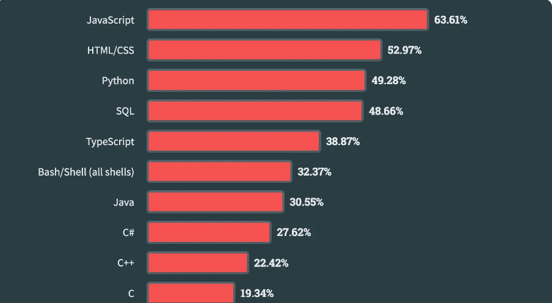
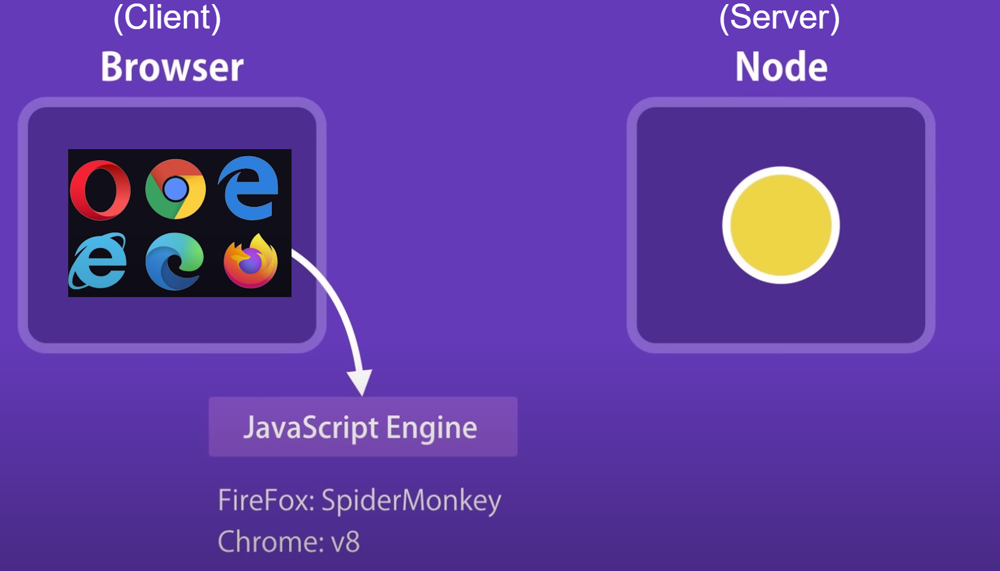

# Einleitung

## Allgemeines

- entwickelt 1995 von Brendan Eich um Webseiten mit Interaktion auszustatten
- Eine der beliebtesteten Programmiersprachen
- Trotz Namensähnlichkeit nicht mit JAVA verwandt, aber beide orientieren sich von der Syntax an C
  {height=150%}

## Wer steht hinter JavaScript

ECMA International (früher: European Computer Manufacturers Association)


## Wo läuft JavaScript?



## Auf welchen Plattformen läuft JavaScript?

- Server Applikationen-> Node.js
- Desktop Applikationen -> Electron
- Mobile Applikationen -> React Native oder Ionic


## Einbindung JavaScript - Eingebettetes im HTML

```html
<!DOCTYPE html>
<html lang="de">
  <head>
    <meta charset="UTF-8" />
    <title>Meine Webseite</title>
  </head>
  <body>
    <h1>Willkommen auf meiner Webseite</h1>
    <script>
      console.log("Hallo Welt");
    </script>
  </body>
</html>
```

---

## Einbindung JavaScript - Extern referenziert im HTML

1. Erstelle eine Datei namens script.js mit folgendem Inhalt:

```javascript
alert("Hallo, Welt!");
```

2. Binde die externe Datei in dein HTML-Dokument ein

```html
<!DOCTYPE html>
<html lang="de">
  <head>
    <meta charset="UTF-8" />
    <title>Meine Webseite</title>
  </head>
  <body>
    <h1>Willkommen auf meiner Webseite</h1>
    <script src="script.js"></script>
  </body>
</html>
```

---

##  Einbindung JavaScript - Konsole

1. Öffne die Entwicklertools in deinem Browser: In Chrome: Rechtsklick -> "Untersuchen" -> Tab "Konsole" oder <kbd>F12</kbd>

2. Führe JavaScript-Code direkt in der Konsole aus:

```javascript
console.log("Hallo, Welt!");
```

---

##  Einbindung JavaScript - Standalone

1. Erstelle eine Datei mit folgendem Inhalt und speicher sie als Test.js ab

```javascript
console.log("Hallo, Welt!");
```

2. Öffne sie mit einem Browser
3. Öffne die Konsole wie zuvor gezeigt

# Datentypen

## Variables

### Übersicht

- speichern Daten temporär
- Analogie: beschrifteter Karton mit Inhalt

---

| **Kom-ponente (DE)** | **Kom-ponente (EN)** | **Beschreibung**                                                            | **Beispiel**    |
| -------------------- | -------------------- | --------------------------------------------------------------------------- | --------------- |
| Bezeichner           | Identifier           | Name der Variable, die ihren Wert bezeichnet.                               | test            |
| Literal              | Literal              | Wert, der der Variable zugewiesen wird.                                     | 42, "Text"      |
| Schlüssel-wort       | Keyword              | Reserviertes Wort in der Programmiersprache für Deklaration oder Steuerung. | let, const, var |

---

### Keyword in JavaScript

- var (veraltet, weil globaler scope(Geltungsbereich))
- let (block-scoped -> Geltungsbereich ist eine näheste von geschweiften Klammern umschlossenen Syntaxen, z.B. if statement)
- const (block-scoped, kann nicht nochmals zugewiesen werden)

---

### Numerische und Boolsche Literals

| **Typ**                 | **Beispiel**          |
| ----------------------- | --------------------- |
| Hexadezimale Konstanten | `var test = 0x12f`    |
| Binäre Konstanten       | `var test = 0b011101` |
| Oktale Konstanten       | `var test = 0o767`    |
| Ganzzahlenkonstanten    | `var test = 123456`   |
| Gleitkommazahlen        | `var test = 12.34`    |
|                         | `var test = 12.34e2`  |
| Boolesche Konstanten    | `var test = true`     |
|                         | `var test = false`    |

---

### Zeichenketten/Strings Literals

```javascript
var jsString = `Das ist ein String`; // Backticks
var jsString = "Das ist ein String"; // einfache Anführungs-zeichen
var jsString = "Das ist ein String"; // doppelte Anführungs-zeichen

// Vorteil von Backticks:
var jsString = `half of 100 is ${100 / 2}`;
console.log(jsString);
// -> half of 100 is 50
```

## Kommentare

### Einzeilige Kommentare

- Verwenden Sie `//` gefolgt vom Kommentartext.

```javascript
// Dies ist ein einzeiliger Kommentar
let x = 5; // Variable x wird initialisiert
```

### Mehrzeilige Kommentare

- Verwenden Sie `/*` und `*/` für längere Erklärungen.

```javascript
/*
Dies ist ein mehrzeiliger Kommentar.
Es kann auf mehreren Zeilen geschrieben werden.
Nützlich für ausführliche Beschreibungen.
*/
let y = 10;
```

## Operatoren

| Operator | Bedeutung                              | Beispiel     |
| -------- | -------------------------------------- | ------------ |
| +, +=    | Addition                               | x+=3         |
| -, -=    | Subtraktion                            | x=x-5        |
| _, _=    | Multiplikation                         | a=b\*c       |
| /, /=    | Division                               | z=e/5        |
| %        | Modulus                                | m=5 % 3      |
| ++, --   | Inkrement, Dekrement                   | x++ oder y-- |
| <<, <<=  | Bitweise Linksschieben                 | x << 4       |
| >>, >>=  | Bitweise Rechtsschieben                | y >> 5       |
| >>>      | Bitweise Linksschieben mit Nullfüllung | a >>> b      |
| &        | Bitweise UND                           | a & b        |
| \|       | Bitweise ODER                          | a \| b       |
| ^        | Bitweise Negieren                      | a ^ b        |

## Elementare Datentypen

- Dynamisch typisiert -> bedeutet nicht, das JS eine untypisierte Sprache ist. Vielmehr werden die Typen automatisiert bei der Wertzuweisung vergeben

- Typen:​

  - Number: Zahlen​
  - String: Zeichenketten​
  - Boolean: logische Werte​
  - Object: alles andere

- Spezielle Zustände von Variablen​
  - undefined bedeutet, dass einer Variable kein Wert zugewiesen wurde.
  - null ist ein absichtlich zugewiesener Wert, der "kein Wert" oder "leerer Wert" bedeutet

## Automatische Typumwandlung

Wird ein Operator auf einen Wert eines unpassenden Typs angewandt, wandelt JS diesen Wert stillschweigend in den erforderlichen Wert um​ => implizierte Typumwandlung

```javascript
console.log(8 * null); // -> 0
```

8 \* null ergibt 0, da null bei arithmetischen Operationen zu 0 konvertiert wird.

```javascript
console.log("5" - 1); // -> 4
```

"5" - 1 ergibt 4, weil der String "5" bei Subtraktion zu einer Zahl konvertiert wird.

```javascript
console.log("5" + 1); // -> 51
```

"five" kann nicht in eine Zahl umgewandelt werden.
Der +-Operator führt hier zur Zeichenkettenverknüpfung

```javascript
console.log("five" * 2); // -> NaN
```

"five" kann nicht in eine Zahl umgewandelt werden

```javascript
console.log(false == 0); // -> true
```

false wird in 0 umgewandelt und ist gleich 0 bei losem Vergleich (==).

# Arbeiten mit Datenstrukturen

## Object

- Ein Object ist ein Dictionary bestehend aus Name/Werte-Paaren​
- Ein neues Object wird mit new Object() oder dem Literal {} erzeugt​
- Auf Inhalte in einem Object kann über die Dot-Notation oder die Index-Notation zugegriffen werden

```html
<script type="text/javascript">
  var Person = {};
  Person.Surname = "Luca"; // Dot-Notation
  Person["Lastname"] = "Berres"; // Index-Notation

  document.write(`Hallo ${Person["Surname"]}
  ${Person.Lastname}!`);
</script>
```

## Arrays

- Ein Array wird mit dem Konstruktor new Array() oder dem Literal [ ] angelegt​

- Ein existierendes Array kann über vordefinierte Methoden verändert werden​

  - push(e) //Fügt ein Element am Ende ein und gibt die neue Länge zurück.​

  - pop() // Entfernt das Element am Ende und gibt es zurück.​

  - reverse() // Dreht die Reihenfolge der Elemente im Array um.​

  - shift() // Entfernt das Element am Anfang und gibt es zurück.​

  - sort() // Sortiert das Array und gibt das neue Array zurück.​

  - splice(start, entfernen, neu…) // Entfernt Elemente und fügt neue ein.​

---

- unshift(neu…) // Fügt Elemente am Anfang mein und gibt die neue Länge zurück.

- slice(start, ende) // Extrahiert den Teil eines Arrays von start bis ende.​

- concat(array) // Verbindet Arrays zu einem neuen Array.​

- indexOf(s) // Index der ersten Fundstelle der Zeichen s oder -1, falls nichts gefunden wurde​

- forEach(callback, this) // Ruft eine Funktion callback für jedes Element des Arrays auf. Der Parameter this kann benutzt werden, um der Funktion den Wert für this vorzugeben. ​

- map(callback, this) // Gibt die Elemente zurück, die die Rückruffunktion für jedes Element zurückgibt.

## Map

Die map-Methode in JavaScript ist eine nützliche Array-Methode, die ein neues Array erstellt, indem eine Funktion auf jedes Element des ursprünglichen Arrays angewendet wird. Diese Methode verändert das ursprüngliche Array nicht.

```javascript
let newArray = array.map(function (element, index, array) {
  // Rückgabewert für das neue Array
});
```

- element: Das aktuelle Element, das verarbeitet wird.
- index (optional): Der Index des aktuellen Elements.
- array (optional): Das Array, auf dem map aufgerufen wurde.

---

```javascript
// Ursprüngliches Array
let numbers = [1, 2, 3, 4, 5];
// Erstelle ein neues Array, das die Quadrate der ursprünglichen Zahlen enthält
let squares = numbers.map(function (number) {
  return number * number;
});
// Ausgabe: [1, 4, 9, 16, 25]
console.log(squares);
```

1. Wir haben ein Array numbers mit den Werten [1, 2, 3, 4, 5].
2. Wir verwenden map, um ein neues Array squares zu erstellen, das die Quadrate der ursprünglichen Zahlen enthält.
   3.Die an map übergebene Funktion nimmt jedes Element des Arrays numbers, quadriert es und gibt das Ergebnis zurück.
3. Das resultierende Array squares enthält die Werte [1, 4, 9, 16, 25].

## Spread-Operator

- Spezieller Operator, der zur Expansion von Objekten in Array-Elementen dient​

- Der Spread-Operator … wird dem Array vorangestellt, um die Auflösung des Arrays zu erzwingen

```javascript
var parts = ["shoulders", "knees"];
var more_parts = ["head", ...parts, "foot", "toes"];

console.log(more_parts);
// Output -> ['head', 'shoulders', 'knees', 'foot', 'toes']
```

# Logik und Kontrollfluss

## Vergleichsoperatoren

JavaScript enthält folgende logische Vergleichsoperatoren​

- == // Vergleich auf Wert-Gleichheit​
- != // Vergleich auf Wert-Ungleichheit​
- === // Vergleich auf Wert- und Typ-Gleichheit​
- !== // Vergleich auf Wert- und Typ-Ungleichheit​
- && // Logisches UND​
- || // Logisches ODER​
- ! // Logisches Nein (not)

## Short Circuit Evaluation

### Erklärung

Short Circuit Evaluation ist eine Programmiertechnik, bei der der Auswertungsprozess eines logischen Ausdrucks frühzeitig beendet wird, sobald das Ergebnis feststeht.

### Beispiele in JavaScript

### Logisches UND (&&)

```javascript
const a = 4 > 3;
const b = 4;
const result = a && b;
```

result ist 4, weil a wahr ist und && den zweiten Operanden zurückgibt

---

### Logisches ODER ||

```javascript
const a = 4 < 3;
const b = 4;
const result = a || b;
```

result ist 4, weil a falsch ist und || den zweiten Operanden zurückgibt

### Übung

1. ```javascript
   const result = 7 > 3 || 7;
   ```

2. ```javascript
   const i = 6 > 3;
   const j = 0;
   const k = 15;
   const result5 = (i && j) || k;
   ```

## Falsy und Truthy in JavaScript

### Falsy Werte

- `false`
- `0` (Null)
- `''` (Leerer String)
- `null`
- `undefined`
- `NaN` (Not a Number)

### Truthy Werte

- Alles, was nicht falsy ist
- Beispiele:
  - `true`
  - Jede Zahl außer 0 (auch negative Zahlen)
  - Jeder nicht-leere String (auch "false")
  - `{}` (Leeres Objekt)
  - `[]` (Leeres Array)

---

### Anwendung

- In Bedingungen: `if (value) { ... }`
- Mit logischen Operatoren: `value || defaultValue`
- Ternärer Operator: `value ? trueResult : falseResult`

### Vorsicht

- Loose equality (`==`) vs. Strict equality (`===`)
- Explizite Typprüfung für präzise Logik

# Kontrollstrukturen

## If – else:

- If-Ausdruck vom Typ Boolean
- Der `else`-Zweig ist optional

```javascript
var test = true;

if (test) {
  console.log("True");
} else {
  console.log("False");
}
// Output -> True
```

---

```javascript
// Wahrheitsgehalt ausgewertet durch Vergleichsoperator
var number = Number(prompt("Pick a number"));
if (number < 10) {
  console.log("under 10");
} else if (number < 100) {
  console.log("under 100");
} else {
  console.log("larger than 100");
}

// Einzeiliges If, bei nur einer Anweisung
if (1 + 1 == 2) console.log("It's true");
// -> It's true
```

## switch – else – default:{.allowframebreaks}

- Der `switch` Befehl dient zur Fallunterscheidung

```javascript
switch (expression) {
    case value1:
        // Anweisungen werden ausgeführt,
        // falls expression mit value1 übereinstimmt
        [break;]
    case value2:
        // Anweisungen werden ausgeführt,
        // falls expression mit value2 übereinstimmt
        [break;]
    ...
    case valueN:
        // Anweisungen werden ausgeführt,
        // falls expression mit valueN übereinstimmt
        [break;]
    default:
        // Anweisungen werden ausgeführt,
        // falls keine der case-Klauseln mit expression übereinstimmt
        [break;]
}
```

## Schleifen

### while

**Syntax:**

```javascript
while (condition) {
  // code block to be executed
}
```

**Beispiel:**

```javascript
while (i < 10) {
  text += "The number is " + i;
  i++;
}
```

---

### do

**Syntax:**

```javascript
do {
  // code block to be executed
} while (condition);
```

**Beispiel:**

```javascript
var text = "";
var i = 0;
do {
  text += "The number is " + i;
  i++;
} while (i < 5);
```

---

### for

**Syntax:**

```javascript
for (statement 1; statement 2; statement 3) {
    // code block to be executed
}
```

**Anweisung 1** wird (einmal) vor der Ausführung des Codeblocks ausgeführt.

**Anweisung 2** definiert die Bedingung für die Ausführung des Codeblocks.

**Anweisung 3** wird (jedes Mal) nach der Ausführung des Codeblocks ausgeführt.

**Beispiel:**

```javascript
for (let i = 0; i < 5; i++) {
  text += "The number is " + i + "<br>";
}
```

---

### Vorzeitiger Schleifenabbruch

Eine Schleife kann durch `break` auch vorzeitig beendet werden.

```javascript
for (var i = 0; ; i++) {
  if (i > 2) {
    break;
  }
  console.log(i);
}
// -> 0
// -> 1
// -> 2
```

# Modularisierung

## Funktionen{.allowframebreaks}

### Was ist eine Funktion?

- Eine Funktion ist ein wiederverwendbarer Codeblock, der eine bestimmte Aufgabe ausführt.
- Funktionen können Parameter akzeptieren und Werte zurückgeben.
- Funktionen helfen, den Code modular und lesbarer zu gestalten.

### Funktionsdeklaration

```javascript
function greet(name) {
  return `Hallo, ${name}!`;
}
```

- `greet` ist der Name der Funktion.
- `name` ist ein Parameter.
- `return` gibt den Wert an den Aufrufer zurück.

### Funktionsaufruf

```javascript
let message = greet("Max");
console.log(message); // Output: Hallo, Max!
```

- Der Funktionsname wird mit den Argumenten aufgerufen.
- Das Ergebnis wird in einer Variable gespeichert oder direkt verwendet.

### Anonyme Funktionen und Arrow Functions

#### Anonyme Funktion:

```javascript
let greet = function (name) {
  return `Hallo, ${name}!`;
};
```

- Funktionen ohne Namen, häufig als Callback-Funktionen verwendet

#### Arrow Function:

```javascript
let greet = (name) => `Hallo, ${name}!`;
```

- Kürzere Syntax für anonyme Funktionen, eingeführt in ES6

<!-- ### Exkurs Callback

Callback = Rückruf

```javascript
function askName(callback) {
  // Simuliert die Eingabe des Benutzers
  const name = prompt("Bitte gib deinen Namen ein:");
  // Ruft das Callback auf und übergibt den Namen
  callback(name);
}

// Funktionsparameter von askName ist eine
// anonymer Pfeilfunktion
askName((name) => {
  console.log(`Hallo, ${name}!`);
});
``` -->

### Funktionen mit mehreren Parametern

```javascript
function add(a, b) {
  return a + b;
}

let sum = add(5, 3);
console.log(sum); // Output: 8
```

- Funktionen können mehrere Parameter akzeptieren.
- Argumente werden in der Reihenfolge der Parameter übergeben.

### Standardwerte für Parameter

```javascript
function greet(name = "Welt") {
  return `Hallo, ${name}!`;
}

console.log(greet()); // Output: Hallo, Welt!
```

- Parameter können Standardwerte haben, die verwendet werden, wenn kein Argument übergeben wird.

### Funktionen als Argumente

```javascript
function performOperation(a, b, operation) {
  return operation(a, b);
}

let result = performOperation(5, 3, add);
console.log(result); // Output: 8
```

- Funktionen können als Argumente an andere Funktionen übergeben werden.

### Funktionen, die andere Funktionen zurückgeben

```javascript
function multiplier(factor) {
  return (x) => x * factor;
}

let doubler = multiplier(2);
console.log(doubler(5)); // Output: 10
```

- Funktionen können andere Funktionen zurückgeben, um benutzerdefinierte Logik zu erstellen.

## ES Modules{.allowframebreaks}

### Was sind ES Modules?

- **Definition:** ES Modules (ECMAScript Modules) sind der standardisierte Weg, um Module in JavaScript zu schreiben und zu verwenden.
- **Zweck:** Ermöglichen das Aufteilen von Code in kleinere, wiederverwendbare Teile (Module), die einfach importiert und exportiert werden können.
- Weitere Techniken wie z.B. CommonJS, diese sind aber veraltet

### Modul-Export

#### Named Export:

```javascript
// datei: math.js
export function add(a, b) {
  return a + b;
}
```

Mehrere Exporte pro Datei möglich

#### Default Export

```javascript
// datei: math.js
export default function subtract(a, b) {
  return a - b;
}
```

Ein Export pro Datei möglich

---

### Modul Import

#### Named Import

```javascript
// datei: main.js
import { add } from "./math.js";

console.log(add(2, 3)); // Ausgabe: 5
```

#### Default import

```javascript
// datei: main.js
import subtract from "./math.js";

console.log(subtract(5, 2)); // Ausgabe: 3
```

# Fehlerbehandlung

## Fehlerbehandlung{.fragile}

Syntax:

```javascript
try {
    tryCode - Block of code to try
}
catch(err) {
    catchCode - Block of code to handle errors
}
finally {
    finallyCode - Block of code to be executed regardless
    of the try/catch result
}
```

---

## Beispiel {.squeeze}

```javascript
try {
  let result = 10 / 0;
  console.log(result);
} catch (error) {
  console.error("Fehler:", error.message);
} finally {
  console.log("Fertig!");
}
```

# Ausblick und Fazit

## Objektorientierung

{height=150%}

## Fazit

{ width=50% }

- Diese Präsentation bot eine erste Einführung in die Grundlagen von JavaScript.
- Der Fokus lag auf einem Überblick ohne Anspruch auf Vollständigkeit.
- Es gibt viele weiterführende Details, Themen und Konzepte, die hier nicht behandelt wurden.
- Dennoch bietet dieses Fundament eine solide Basis für das Verständnis von React und allgemeiner Frontend-Entwicklung.
