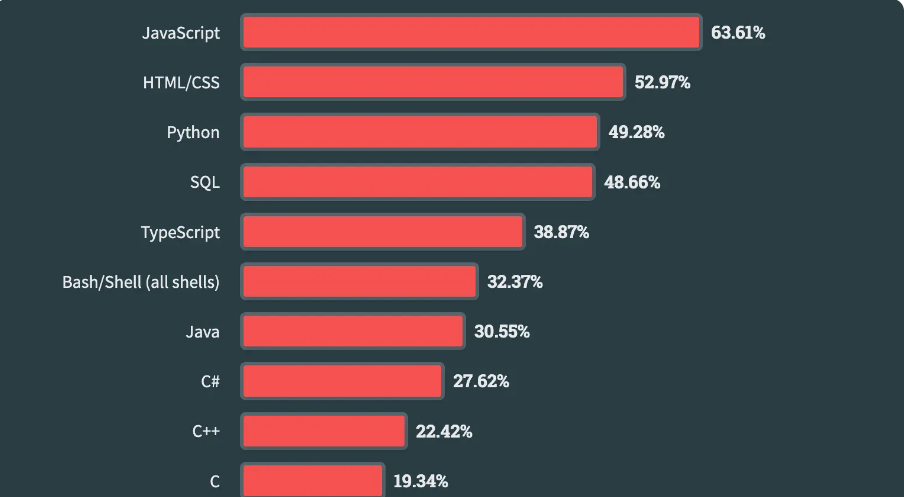
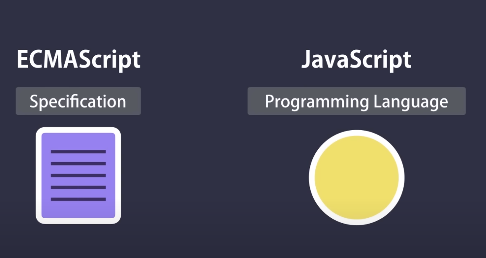
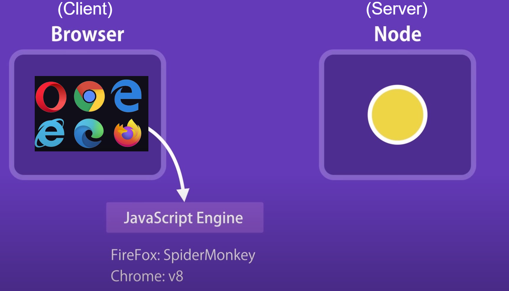

# Allgemines zu JavaScript

## Allgemeines

- entwickelt 1995 von Brendan Eich um Webseiten mit Interaktion auszustatten
- Eine der beliebtesteten Programmiersprachen
- Trotz Namensähnlichkeit nicht mit JAVA verwandt, aber beide orientieren sich von der Syntax an C
  {height=150%}

## Wer steht hinter JavaScript

ECMA International (früher: European Computer Manufacturers Association)



## Wo läuft JavaScript?



## Auf welchen Plattformen läuft JavaScript?

- Server Applikationen-> Node.js
- Desktop Applikationen -> Electron
- Mobile Applikationen -> React Native oder Ionic

# Syntax

# Einbindung JavaScript

## Eingebettetes im HTML

```html
<!DOCTYPE html>
<html lang="de">
  <head>
    <meta charset="UTF-8" />
    <title>Meine Webseite</title>
  </head>
  <body>
    <h1>Willkommen auf meiner Webseite</h1>
    <script>
      console.log("Hallo Welt");
    </script>
  </body>
</html>
```

---

## Extern referenziert im HTML

1. Erstelle eine Datei namens script.js mit folgendem Inhalt:

```javascript
alert("Hallo, Welt!");
```

2. Binde die externe Datei in dein HTML-Dokument ein

```html
<!DOCTYPE html>
<html lang="de">
  <head>
    <meta charset="UTF-8" />
    <title>Meine Webseite</title>
  </head>
  <body>
    <h1>Willkommen auf meiner Webseite</h1>
    <script src="script.js"></script>
  </body>
</html>
```

---

## Konsole

1. Öffne die Entwicklertools in deinem Browser: In Chrome: Rechtsklick -> "Untersuchen" -> Tab "Konsole" oder <kbd>F12</kbd>

2. Führe JavaScript-Code direkt in der Konsole aus:

```javascript
console.log("Hallo, Welt!");
```

---

## Standalone

1. Erstelle eine Datei mit folgendem Inhalt und speicher sie als Test.js ab

```javascript
console.log("Hallo, Welt!");
```

2. Öffne sie mit einem Browser
3. Öffne die Konsole wie zuvor gezeigt

---

# Allgemine Programmierkonzepte

## Kommenatere

## Variables

### Übersicht

- speichern Daten temporär
- Analogie: beschrifteter Karton mit Inhalt

---

| **Kom-ponente (DE)** | **Kom-ponente (EN)** | **Beschreibung**                                                            | **Beispiel**    |
| -------------------- | -------------------- | --------------------------------------------------------------------------- | --------------- |
| Bezeichner           | Identifier           | Name der Variable, die ihren Wert bezeichnet.                               | test            |
| Literal              | Literal              | Wert, der der Variable zugewiesen wird.                                     | 42, "Text"      |
| Schlüssel-wort       | Keyword              | Reserviertes Wort in der Programmiersprache für Deklaration oder Steuerung. | let, const, var |

---

### Keyword in JavaScript

- var (veraltet, weil globaler scope(Geltungsbereich))
- let (block-scoped -> Geltungsbereich ist eine näheste von geschweiften Klammern umschlossenen Syntaxen, z.B. if statement)
- const (block-scoped, kann nicht nochmals zugewiesen werden)

---

### Numerische und Boolsche Literals

| **Typ**                 | **Beispiel**          |
| ----------------------- | --------------------- |
| Hexadezimale Konstanten | `var test = 0x12f`    |
| Binäre Konstanten       | `var test = 0b011101` |
| Oktale Konstanten       | `var test = 0o767`    |
| Ganzzahlenkonstanten    | `var test = 123456`   |
| Gleitkommazahlen        | `var test = 12.34`    |
|                         | `var test = 12.34e2`  |
| Boolesche Konstanten    | `var test = true`     |
|                         | `var test = false`    |

---

### Zeichenketten/Strings Literals

```javascript
var jsString = `Das ist ein String`; // Backticks
var jsString = "Das ist ein String"; // einfache Anführungs-zeichen
var jsString = "Das ist ein String"; // doppelte Anführungs-zeichen

// Vorteil von Backticks:
var jsString = `half of 100 is ${100 / 2}`;
console.log(jsString);
// -> half of 100 is 50
```

## Operatoren

| Operator | Bedeutung                              | Beispiel     |
| -------- | -------------------------------------- | ------------ |
| +, +=    | Addition                               | x+=3         |
| -, -=    | Subtraktion                            | x=x-5        |
| _, _=    | Multiplikation                         | a=b\*c       |
| /, /=    | Division                               | z=e/5        |
| %        | Modulus                                | m=5 % 3      |
| ++, --   | Inkrement, Dekrement                   | x++ oder y-- |
| <<, <<=  | Bitweise Linksschieben                 | x << 4       |
| >>, >>=  | Bitweise Rechtsschieben                | y >> 5       |
| >>>      | Bitweise Linksschieben mit Nullfüllung | a >>> b      |
| &        | Bitweise UND                           | a & b        |
| \|       | Bitweise ODER                          | a \| b       |
| ^        | Bitweise Negieren                      | a ^ b        |

## Elementare Datentypen

- Dynamisch typisiert -> bedeutet nicht, das JS eine untypisierte Sprache ist. Vielmehr werden die Typen automatisiert bei der Wertzuweisung vergeben

- Typen:​

  - Number: Zahlen​
  - String: Zeichenketten​
  - Boolean: logische Werte​
  - Object: alles andere

- Spezielle Zustände von Variablen​
  - undefined bedeutet, dass einer Variable kein Wert zugewiesen wurde.
  - null ist ein absichtlich zugewiesener Wert, der "kein Wert" oder "leerer Wert" bedeutet

## Automatische Typumwandlung

Wird ein Operator auf einen Wert eines unpassenden Typs angewandt, wandelt JS diesen Wert stillschweigend in den erforderlichen Wert um​ => implizierte Typumwandlung

```javascript
console.log(8 * null); // -> 0
```

8 \* null ergibt 0, da null bei arithmetischen Operationen zu 0 konvertiert wird.

```javascript
console.log("5" - 1); // -> 4
```

"5" - 1 ergibt 4, weil der String "5" bei Subtraktion zu einer Zahl konvertiert wird.

```javascript
console.log("5" + 1); // -> 51
```

"five" kann nicht in eine Zahl umgewandelt werden.
Der +-Operator führt hier zur Zeichenkettenverknüpfung

```javascript
console.log("five" * 2); // -> NaN
```

"five" kann nicht in eine Zahl umgewandelt werden

```javascript
console.log(false == 0); // -> true
```

false wird in 0 umgewandelt und ist gleich 0 bei losem Vergleich (==).

## Object

- Ein Object ist ein Dictionary bestehend aus Name/Werte-Paaren​
- Ein neues Object wird mit new Object() oder dem Literal {} erzeugt​
- Auf Inhalte in einem Object kann über die Dot-Notation oder die Index-Notation zugegriffen werden

```html
<script type="text/javascript">
  var Person = {};
  Person.Surname = "Luca"; // Dot-Notation
  Person["Lastname"] = "Berres"; // Index-Notation

  document.write(`Hallo ${Person["Surname"]} 
  ${Person.Lastname}!`);
</script>
```

## Arrays

- Ein Array wird mit dem Konstruktor new Array() oder dem Literal [ ] angelegt​

- Ein existierendes Array kann über vordefinierte Methoden verändert werden​

  - push(e) //Fügt ein Element am Ende ein und gibt die neue Länge zurück.​

  - pop() // Entfernt das Element am Ende und gibt es zurück.​

  - reverse() // Dreht die Reihenfolge der Elemente im Array um.​

  - shift() // Entfernt das Element am Anfang und gibt es zurück.​

  - sort() // Sortiert das Array und gibt das neue Array zurück.​

  - splice(start, entfernen, neu…) // Entfernt Elemente und fügt neue ein.​

---

- unshift(neu…) // Fügt Elemente am Anfang mein und gibt die neue Länge zurück.

- slice(start, ende) // Extrahiert den Teil eines Arrays von start bis ende.​

- concat(array) // Verbindet Arrays zu einem neuen Array.​

- indexOf(s) // Index der ersten Fundstelle der Zeichen s oder -1, falls nichts gefunden wurde​

- forEach(callback, this) // Ruft eine Funktion callback für jedes Element des Arrays auf. Der Parameter this kann benutzt werden, um der Funktion den Wert für this vorzugeben. ​

- map(callback, this) // Gibt die Elemente zurück, die die Rückruffunktion für jedes Element zurückgibt.

## Map

Die map-Methode in JavaScript ist eine nützliche Array-Methode, die ein neues Array erstellt, indem eine Funktion auf jedes Element des ursprünglichen Arrays angewendet wird. Diese Methode verändert das ursprüngliche Array nicht.

```javascript
let newArray = array.map(function (element, index, array) {
  // Rückgabewert für das neue Array
});
```

- element: Das aktuelle Element, das verarbeitet wird.
- index (optional): Der Index des aktuellen Elements.
- array (optional): Das Array, auf dem map aufgerufen wurde.

---

```javascript
// Ursprüngliches Array
let numbers = [1, 2, 3, 4, 5];
// Erstelle ein neues Array, das die Quadrate der ursprünglichen Zahlen enthält
let squares = numbers.map(function (number) {
  return number * number;
});
// Ausgabe: [1, 4, 9, 16, 25]
console.log(squares);
```

1. Wir haben ein Array numbers mit den Werten [1, 2, 3, 4, 5].
2. Wir verwenden map, um ein neues Array squares zu erstellen, das die Quadrate der ursprünglichen Zahlen enthält.
   3.Die an map übergebene Funktion nimmt jedes Element des Arrays numbers, quadriert es und gibt das Ergebnis zurück.
3. Das resultierende Array squares enthält die Werte [1, 4, 9, 16, 25].

## Spread-Operator

- Spezieller Operator, der zur Expansion von Objekten in Array-Elementen dient​

- Der Spread-Operator … wird dem Array vorangestellt, um die Auflösung des Arrays zu erzwingen

```javascript
var parts = ["shoulders", "knees"];
var more_parts = ["head", ...parts, "foot", "toes"];

console.log(more_parts);
// Output -> ['head', 'shoulders', 'knees', 'foot', 'toes']
```

## Vergleichsoperatoren

JavaScript enthält folgende logische Vergleichsoperatoren​

- == // Vergleich auf Wert-Gleichheit​
- != // Vergleich auf Wert-Ungleichheit​
- === // Vergleich auf Wert- und Typ-Gleichheit​
- !== // Vergleich auf Wert- und Typ-Ungleichheit​
- && // Logisches UND​
- || // Logisches ODER​
- ! // Logisches Nein (not)

## Short Circuit Evaluation

### Erklärung

Short Circuit Evaluation ist eine Programmiertechnik, bei der der Auswertungsprozess eines logischen Ausdrucks frühzeitig beendet wird, sobald das Ergebnis feststeht.

### Beispiele in JavaScript

### Logisches UND (&&)

```javascript
const a = 4 > 3;
const b = 4;
const result = a && b;
```

result ist 4, weil a wahr ist und && den zweiten Operanden zurückgibt

---

### Logisches ODER ||

```javascript
const a = 4 < 3;
const b = 4;
const result = a || b;
```

result ist 4, weil a falsch ist und || den zweiten Operanden zurückgibt

### Übung

1. ```javascript
   const result = 7 > 3 || 7;
   ```

2. ```javascript
   const i = 6 > 3;
   const j = 0;
   const k = 15;
   const result5 = (i && j) || k;
   ```

## Falsy und Truthy in JavaScript

### Falsy Werte

- `false`
- `0` (Null)
- `''` (Leerer String)
- `null`
- `undefined`
- `NaN` (Not a Number)

### Truthy Werte

- Alles, was nicht falsy ist
- Beispiele:
  - `true`
  - Jede Zahl außer 0 (auch negative Zahlen)
  - Jeder nicht-leere String (auch "false")
  - `{}` (Leeres Objekt)
  - `[]` (Leeres Array)

---

### Anwendung

- In Bedingungen: `if (value) { ... }`
- Mit logischen Operatoren: `value || defaultValue`
- Ternärer Operator: `value ? trueResult : falseResult`

### Vorsicht

- Loose equality (`==`) vs. Strict equality (`===`)
- Explizite Typprüfung für präzise Logik

## Kontrolstrukturen

## Ternar Operator

## Funktionen

## ES Modules

## Spread Operator 

## Rest Operator 

## Destructuring

## Fehlerbehandlung

## Objektorientierung

## JavaScript APIs

## Was sind JavaScript APIs?
- **API**: Application Programming Interface
- Schnittstelle, die es ermöglicht, Funktionen eines Programms von außen zu nutzen
- In JavaScript: Ermöglicht den Zugriff auf Browser- und Webfunktionen

## Arten von JavaScript APIs

### 1. Browser APIs
- **DOM API**: Manipulation von HTML und CSS
- **Canvas API**: Zeichnen von Grafiken
- **Web Storage API**: Lokale Speicherung von Daten
- **Fetch API**: Netzwerkabrufe und HTTP-Anfragen
- **Geolocation API**: Standortbestimmung des Geräts

### 2. Third-Party APIs
- Zugriff auf Dienste und Datenbanken von Drittanbietern
- Beispiele: Google Maps API, Twitter API, Stripe API

## Asynchrone Programmierung am Beispiel der Ferch API 

- Ausführung von Code, der auf ein Ereignis oder eine Ressource wartet, ohne den Hauptthread zu blockieren
- Netzwerkabfragen, Timer, I/O Operationen
- läuft auf dem Hauptthread
- Nutzung von **Callbacks**, **Promises** und **Async/Await**

## Fetch API Beispiel
- Moderne Methode zum Abrufen von Ressourcen über das Netzwerk
- Rückgabe eines **Promise**-Objekts

## Nutzung der Fetch API mit Promises
```javascript
fetch('https://api.example.com/data')
  .then(response => {
    if (!response.ok) {
      throw new Error('Netzwerkantwort war nicht ok');
    }
    return response.json();
  })
  .then(data => {
    console.log('Daten:', data);
  })
  .catch(error => {
    console.error('Es gab ein Problem mit dem Fetch-Vorgang:', error);
  });
```

## Syntactic Sugar durch async await
```javascript
async function fetchData() {
  try {
    const response = await fetch('https://api.example.com/data');
    if (!response.ok) {
      throw new Error('Netzwerkantwort war nicht ok');
    }
    const data = await response.json();
    console.log('Daten:', data);
  } catch (error) {
    console.error('Es gab ein Problem mit dem Fetch-Vorgang:', error);
  }
}

fetchData();
```

## Parallele Programmierung

- Gleichzeitige Ausführung: Mehrere Operationen laufen gleichzeitig auf verschiedenen Kernen
- Rechenintensive Aufgaben, Bildverarbeitung, wissenschaftliche Berechnungen

```javascript
// main.js
const worker = new Worker('worker.js');
worker.postMessage('Start');

worker.onmessage = function(event) {
  console.log('Ergebnis:', event.data);
};

// worker.js
onmessage = function(event) {
  const result = performHeavyComputation();
  postMessage(result);
};

function performHeavyComputation() {
  // Rechenintensive Aufgabe
}
```

interessante Videos:
https://youtube.com/@theavocoder?si=FRZh-LxMq_4QQWvE