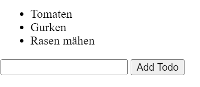

# TODO App

## Basis Anforderung

- Erstelle ein einfaches HTML-Dokument.
- Füge ein Eingabefeld hinzu, in das die Benutzer\*innen ihre To-Dos eingeben können.
- Füge einen Button hinzu, der das To-Do zur Liste hinzufügt, wenn er geklickt wird.
- Erstelle einen leeren ul-Tag, der die To-Dos aufnehmen soll.
- Implementiere eine Funktion, die das eingegebene To-Do zur Liste hinzufügt, wenn der Button geklickt wird.
- Sorge dafür, dass das Eingabefeld nach dem Hinzufügen des To-Dos geleert wird.
  

## Erweiterte Anforderung

- Speichere die ToDos im "localstorage ab", sodass die Todos beim Neuladen der Seite nicht verloren gehen
